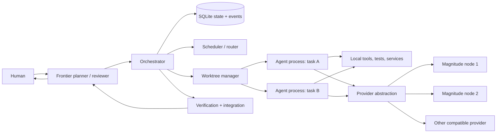
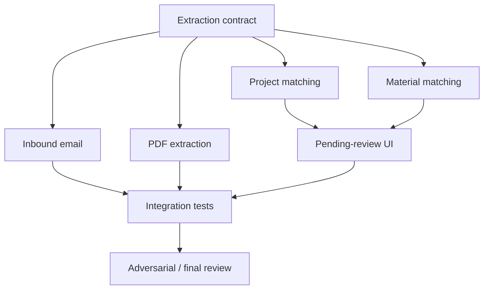
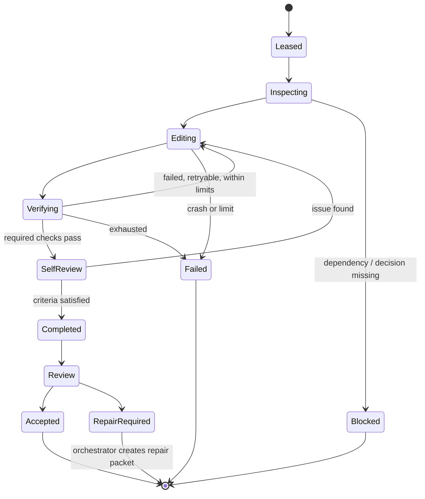
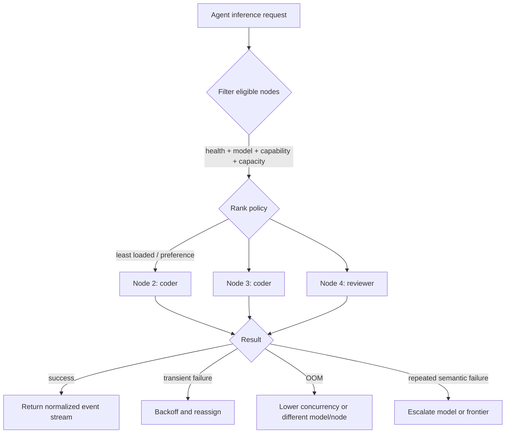
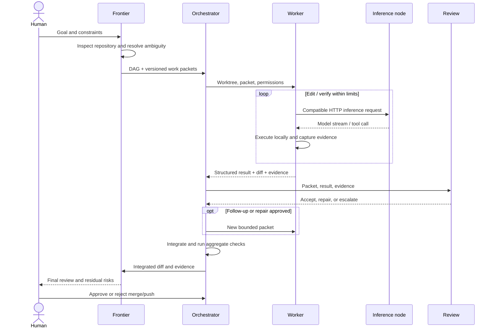

# Diagrams

## High-level system architecture

The agent processes and repository tools remain on the control plane; only inference requests cross to nodes.

## Task DAG

## Worker execution lifecycle

## Multi-node inference routing

## Feature execution lifecycle

